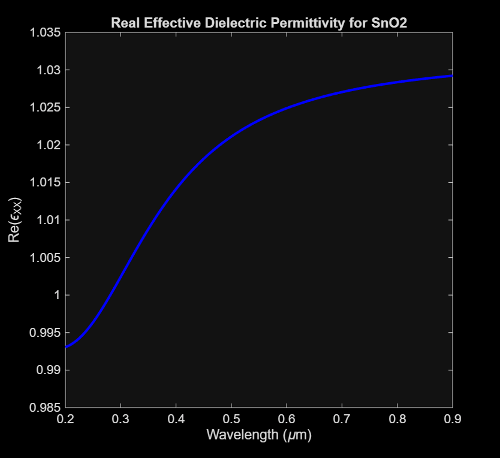

# Tensorial Permittivity Simulation
This is a program that estimates the components of the dielectric permittivity tensor of a a magneto-optic (gyrotropic) anisotropic material using Maxwell-Garnett theory.
The inputs are the nanoparticle radius (b) [nm] and material, magnitude of magnetic flux density (B) [T] applied to nanoparticles, and the range of wavelengths.
The outputs are the components εXX and εXY of the permittivity tensor as a function of wavelength. In the weak field limit, ωB·τ << 1, where ωB is cyclotron frequency and τ is a characteristic relaxation time defined in the Drude model, the diagonal permittivity tensor component εZZ ≃ εXX [1].
The Tensorial Permittivity Simulation function is adapted from the Absorption Simulation function by Kenzie Lewis and Raaja Rajeshwari Manickam, based off algorithm by Dani et al. [2]

## Before running the simulation
Make sure the fitted parameters for the nanoparticle material (for SnO2, Fe2O3, or other) are up to date with the most recent experimental data. All the units are SI.

## Running the simulation
Run the function in the Get Permittivity Tensor file, a script that formats the outputs in an excel table and MATLAB plot. Two separate plots are returned for the real and imaginary parts of the effective permittivity, εeff = εxx.
   

# References
[1] T.K. Xia, P.M. Hui, and D. Stroud, “Theory of Faraday rotation in granular magnetic materials,” Journal of Applied Physics 67(6), 2736–2741 (1990). \
[2] R.K. Dani, H. Wang, S.H. Bossmann, G. Wysin, and V. Chikan, “Supplemental Material for "Faraday rotation enhancement of gold coated Fe2O3 nanoparticles: Comparison of experiment and theory," ” J. Chem. Phys. 135(22), 224502 (2011). \
[3] A. Ibrahim, “Synthesis and Characterization of Magnetic Nanoparticles to Incorporate into Silicon Waveguides to be Used as Optical Isolators,” M.S. thesis, Eng. Phys., McMaster Univ., Hamilton, Ontario, 2019. [Online]. Available: https://macsphere.mcmaster.ca/bitstream/11375/24720/2/Ibrahim_Amr_E_201908_MASc.pdf 
